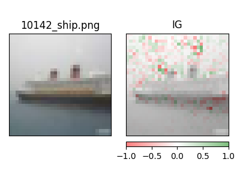

## Torch Serve - Session 08

## Pytest Results

test scripts: tests/test_serve

## Model Metrics

### Explainability Images - Integrated Gradients

## Tensorboard Torch Profiling
dev url: https://tensorboard.dev/experiment/9lH1XkD7RgecMNRevliZZw/#scalars 
